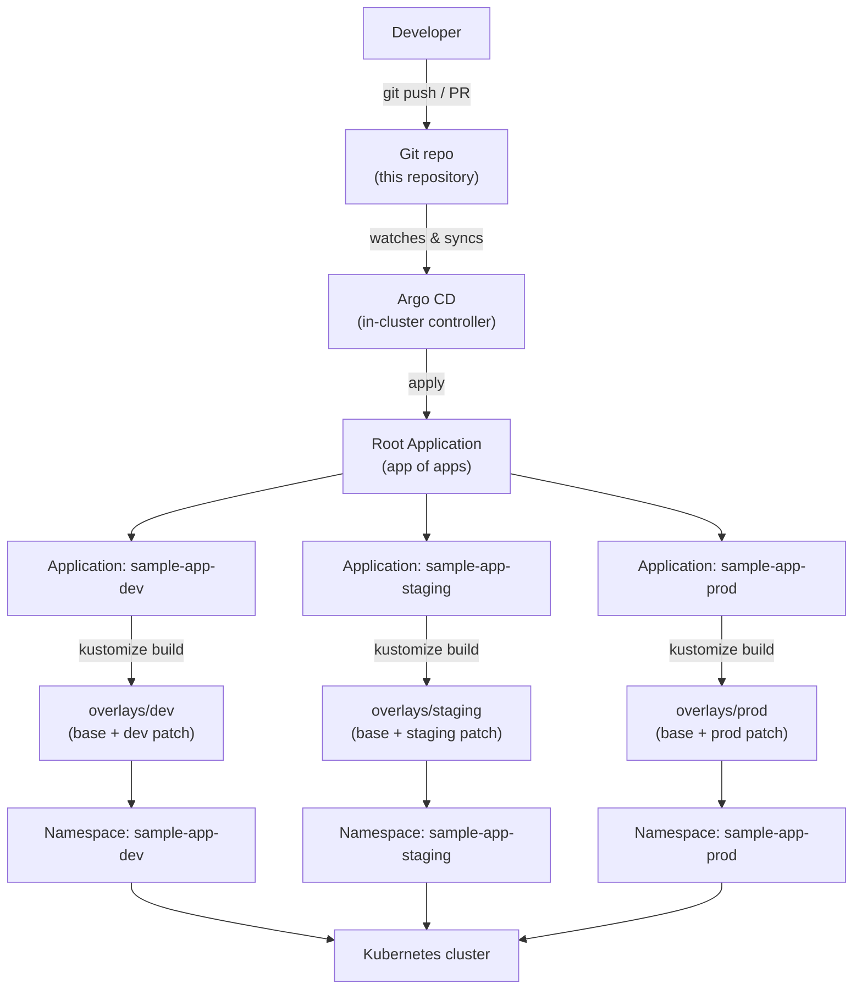

# gitops-argocd-demo

> Declarative, Git-driven Kubernetes delivery — the Argo CD "app of apps" pattern with a Kustomize base and dev/prod overlays.


A small, self-contained portfolio repository that shows how a Git repo becomes
the single source of truth for what runs in a Kubernetes cluster. A sample web
service is defined once as a Kustomize base and specialised per environment
(dev / prod) via overlays. Argo CD watches the repo and continuously reconciles
the cluster to match it.

---

## Overview

**GitOps** is an operating model where the desired state of your system lives in
Git, and an in-cluster agent continuously makes reality match it. You don't
`kubectl apply` by hand or run imperative deploy scripts — you open a pull
request. Merges become deployments; reverts become rollbacks. The Git history
is your audit log, and drift (someone hand-editing the cluster) is automatically
corrected.

This repo uses **[Argo CD](https://argo-cd.readthedocs.io/)** as that agent and
the **app-of-apps** pattern to keep things declarative all the way up:

- Instead of manually creating one Argo CD `Application` per environment, you
  apply a single **root** Application.
- The root Application points at a directory of *other* Application manifests
  (`apps/applications/`).
- Argo CD creates and manages those child Applications for you. Adding a new
  environment or service becomes "add a YAML file and merge" — no console
  clicks, no drift between what's declared and what's running.

## Architecture



## Repository layout

```text
gitops-argocd-demo/
├── apps/                              # The "app of apps" root
│   ├── argocd/
│   │   └── root-app.yaml              # Root Application → watches apps/applications/
│   └── applications/                  # One Argo CD Application per environment
│       ├── sample-app-dev.yaml        #   → workloads/sample-app/overlays/dev
│       ├── sample-app-staging.yaml    #   → workloads/sample-app/overlays/staging
│       └── sample-app-prod.yaml       #   → workloads/sample-app/overlays/prod
│
├── argocd/                            # Argo CD platform config (applied once)
│   ├── INSTALL.md                     # How to install Argo CD + bootstrap the root app
│   └── projects/
│       └── appproject.yaml            # AppProject scoping repo + allowed namespaces
│
├── workloads/
│   └── sample-app/
│       ├── base/                      # Environment-agnostic manifests (the "what")
│       │   ├── deployment.yaml
│       │   ├── service.yaml
│       │   ├── configmap.yaml
│       │   └── kustomization.yaml
│       └── overlays/                  # Per-environment specialisation (the "where/how much")
│           ├── dev/
│           │   ├── kustomization.yaml # namespace, 1 replica, small resources, image tag
│           │   └── patch-deployment.yaml
│           ├── staging/
│           │   ├── kustomization.yaml # namespace, 2 replicas, mid resources, pinned tag
│           │   └── patch-deployment.yaml
│           └── prod/
│               ├── kustomization.yaml # namespace, 3 replicas, larger resources, pinned tag
│               └── patch-deployment.yaml
│
├── .github/workflows/validate.yml     # CI: kustomize build every overlay
├── README.md
├── LICENSE
└── .gitignore
```

**Base vs overlays.** The `base/` holds the manifests that never change between
environments. Each `overlay/` references the base and layers on only the
differences using Kustomize transformers (`namespace`, `commonLabels`,
`images`) plus a strategic-merge `patch-deployment.yaml`. This keeps the shared
definition DRY while making per-environment differences explicit and reviewable.

**Argo CD apps.** The manifests under `apps/` and `argocd/` are what you apply
to the cluster to wire Argo CD up. They tell Argo CD *which paths to watch* and
*where to deploy them* — they don't contain the workload itself.

## How it works — the reconciliation loop

1. You change a manifest and merge it to `main`.
2. Argo CD polls the repo (and/or receives a webhook) and notices the new commit.
3. For each Application, Argo CD runs the equivalent of `kustomize build` on the
   target path to produce the **desired state**.
4. It compares that against the **live state** in the cluster and reports the
   app as `Synced` or `OutOfSync`.
5. With `syncPolicy.automated` enabled, it applies the difference automatically;
   with `selfHeal: true`, it also reverts any manual out-of-band changes so the
   cluster keeps matching Git.

The result is a closed loop: **Git is desired state, the cluster converges to
it, continuously.**

## Getting started

### Prerequisites

- A Kubernetes cluster (a local [kind](https://kind.sigs.k8s.io/) or
  [minikube](https://minikube.sigs.k8s.io/) cluster is fine).
- `kubectl` (v1.27+) — it ships with Kustomize built in.
- [Argo CD](https://argo-cd.readthedocs.io/) installed in the cluster
  (see [`argocd/INSTALL.md`](argocd/INSTALL.md)).

### Test the overlays locally (no cluster needed)

You can render any overlay with the Kustomize built into `kubectl` and confirm
the manifests are valid before Argo CD ever touches them:

```bash
kubectl kustomize workloads/sample-app/overlays/dev
kubectl kustomize workloads/sample-app/overlays/prod
```

(Or, with the standalone binary: `kustomize build workloads/sample-app/overlays/dev`.)
CI runs exactly this on every push — see `.github/workflows/validate.yml`.

### Deploy via Argo CD

After installing Argo CD, bootstrap everything from the root app:

```bash
# 1. scope the project (allowed repo + namespaces)
kubectl apply -f argocd/projects/appproject.yaml

# 2. apply the app-of-apps root — Argo CD does the rest
kubectl apply -f apps/argocd/root-app.yaml
```

Argo CD reconciles the root Application, which creates `sample-app-dev`,
`sample-app-staging` and `sample-app-prod`, which in turn deploy the dev,
staging and prod overlays into their namespaces.

## Environments

| Aspect        | dev (`sample-app-dev`)      | staging (`sample-app-staging`)    | prod (`sample-app-prod`)          |
| ------------- | --------------------------- | --------------------------------- | --------------------------------- |
| Namespace     | `sample-app-dev`            | `sample-app-staging`              | `sample-app-prod`                 |
| Replicas      | 1                           | 2                                 | 3                                 |
| CPU request   | 25m                         | 50m                               | 100m                              |
| Memory limit  | 128Mi                       | 192Mi                             | 256Mi                             |
| Image tag     | `latest` (mutable)          | `plain-text` (pinned)             | `plain-text` (pinned)             |
| Auto-prune    | on                          | on                                | off (manual, safer for prod)      |
| Self-heal     | on                          | on                                | on                                |

Staging sits between dev and prod: it runs more than one replica and pins the
same immutable image tag prod will promote, so a release candidate is exercised
under prod-like conditions before it ships. All other configuration is
inherited unchanged from `workloads/sample-app/base/`.

Every Application also retries failed syncs with exponential backoff, and prod
ignores drift on the Deployment's replica count so a future
HorizontalPodAutoscaler could own it without Argo CD reverting the change.

## Notes

- This is a **portfolio / demo** repository, not a production deployment. The
  sample workload is the public `nginxdemos/hello` image standing in for a real
  web service.
- The `repoURL` in every Argo CD manifest points at
  `https://github.com/matthews-wong/gitops-argocd-demo`. **Fork this repo and
  update the `repoURL` (and, if needed, namespaces/branch) to your own fork**
  before applying — otherwise Argo CD will try to sync from a repo you don't
  control.
- No production claims, metrics, or endorsements here — it's an illustrative
  example of the pattern, kept small on purpose.

## License

Released under the [MIT License](LICENSE). Copyright (c) 2026 Matthews Wong.

---

Part of my cloud & AI portfolio — see [github.com/matthews-wong](https://github.com/matthews-wong).
